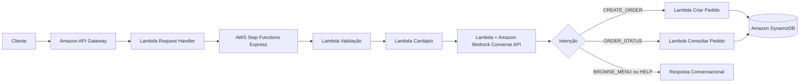

# Assistente de Delivery com AWS Step Functions e Amazon Bedrock

Projeto prático de um assistente de delivery serverless capaz de compreender mensagens em linguagem natural, apresentar o cardápio, registrar pedidos e consultar o status de uma entrega. A solução utiliza o AWS Step Functions para orquestrar cada etapa do atendimento e o Amazon Bedrock para interpretar a intenção do cliente e transformar a conversa em dados estruturados.

O projeto foi desenvolvido como entrega de portfólio para o desafio **Criando um Assistente de Delivery com AWS Step Functions e Bedrock**, da DIO.

## Nome sugerido para o repositório

`aws-bedrock-delivery-assistant`

## Descrição sugerida para o GitHub

Assistente de delivery serverless com AWS Step Functions, Amazon Bedrock, Lambda, API Gateway e DynamoDB, capaz de interpretar pedidos em linguagem natural e orquestrar todo o fluxo de atendimento.

## Visão geral

O cliente envia uma mensagem como:

```text
Quero 2 Burger Classic e uma batata frita.
```

O Amazon API Gateway recebe a requisição e aciona uma função Lambda. Essa função inicia, de forma síncrona, uma máquina de estados Express do AWS Step Functions. O workflow valida a entrada, recupera o cardápio, envia o contexto ao Amazon Bedrock, identifica a intenção e direciona o processamento.

Quando a intenção é criar um pedido, o backend valida todos os itens retornados pelo modelo, calcula o valor com base no cardápio oficial e persiste o pedido no Amazon DynamoDB. Dessa forma, o modelo não controla valores financeiros e não pode inventar preços.

## Arquitetura



## Serviços utilizados

| Serviço | Responsabilidade |
|---|---|
| Amazon API Gateway | Expõe o endpoint HTTP do assistente |
| AWS Lambda | Executa validações, integrações e regras de negócio |
| AWS Step Functions | Orquestra o fluxo de atendimento e os tratamentos de erro |
| Amazon Bedrock | Interpreta a mensagem e retorna a intenção em JSON estruturado |
| Amazon DynamoDB | Armazena os pedidos e seus respectivos status |
| AWS SAM | Define, empacota e implanta toda a infraestrutura como código |
| AWS X-Ray | Fornece rastreamento distribuído das funções e do workflow |

## Intenções reconhecidas

O assistente trabalha com quatro intenções controladas:

| Intenção | Exemplo |
|---|---|
| `BROWSE_MENU` | “Quais pizzas vocês têm?” |
| `CREATE_ORDER` | “Quero dois hambúrgueres e uma batata.” |
| `ORDER_STATUS` | “Qual o status do pedido PED-1234ABCD?” |
| `HELP` | “Olá, como funciona?” |

## Estrutura do projeto

```text
aws-bedrock-delivery-assistant/
├── docs/
│   ├── architecture.md
│   └── security-and-costs.md
├── .github/workflows/ci.yml
├── events/
│   ├── browse_menu.json
│   ├── create_order.json
│   └── order_status.json
├── scripts/
│   └── local_demo.py
├── src/
│   ├── bedrock_assistant/
│   ├── create_order/
│   ├── get_menu/
│   ├── get_order/
│   ├── request_handler/
│   └── validate_request/
├── statemachine/
│   └── delivery_assistant.asl.json
├── tests/
│   └── test_handlers.py
├── template.yaml
├── Makefile
├── LICENSE
└── README.md
```

## Diferenciais da solução

Este projeto vai além de uma demonstração básica. O fluxo utiliza uma máquina de estados Express síncrona para entregar uma resposta HTTP imediata, possui retentativas automáticas para falhas transitórias, tratamento de indisponibilidade, validação das entradas, persistência com expiração automática e separação clara entre inteligência generativa e regra de negócio.

O Bedrock interpreta o texto, mas não define preços nem grava diretamente no banco. Todos os produtos retornados pelo modelo são comparados com o cardápio oficial. O total é calculado exclusivamente pela função responsável pelo pedido.

Também foi incluído um modo local, que permite demonstrar a arquitetura sem chamar o modelo e sem criar recursos na AWS.

## Pré-requisitos

Antes do deploy, instale e configure:

- Python 3.12 ou superior
- AWS CLI
- AWS SAM CLI
- Docker, recomendado para builds compatíveis com Lambda
- Uma conta AWS com permissões para CloudFormation, Lambda, Step Functions, API Gateway, DynamoDB, IAM e Bedrock
- Permissão IAM para invocar o modelo escolhido no Amazon Bedrock

Confira sua identidade configurada:

```bash
aws sts get-caller-identity
```

## Modelo do Amazon Bedrock

O modelo padrão do projeto é:

```text
amazon.nova-lite-v1:0
```

O ID pode ser alterado durante o deploy. Escolha um modelo disponível na região utilizada e confirme as permissões de invocação da função. A função usa a API Converse, que oferece uma interface padronizada para diferentes modelos compatíveis do Amazon Bedrock.

## Executando a demonstração local

A demonstração local utiliza uma interpretação simulada e não acessa o Bedrock nem o DynamoDB.

Instale as dependências de desenvolvimento uma vez:

```bash
pip install -r requirements-dev.txt
```

No Linux, macOS ou Git Bash:

```bash
python scripts/local_demo.py
```

No PowerShell:

```powershell
python .\scripts\local_demo.py
```

Exemplo de saída:

```json
{
  "statusCode": 201,
  "body": {
    "intent": "CREATE_ORDER",
    "reply": "Pedido PED-XXXXXXXX recebido com sucesso..."
  }
}
```

## Executando os testes

```bash
python -m unittest discover -s tests -v
```

## Validando a infraestrutura

```bash
sam validate --lint
```

## Build

```bash
sam build
```

Para construir usando um contêiner compatível com o ambiente do Lambda:

```bash
sam build --use-container
```

## Deploy guiado

```bash
sam deploy --guided
```

Sugestão de respostas:

```text
Stack Name: aws-bedrock-delivery-assistant
AWS Region: us-east-1
Parameter Environment: dev
Parameter BedrockModelId: amazon.nova-lite-v1:0
Confirm changes before deploy: Y
Allow SAM CLI IAM role creation: Y
Save arguments to configuration file: Y
```

Ao final, copie o valor do output `AssistantEndpoint`.

## Testando o endpoint

### Mostrar o cardápio

```bash
curl -X POST "SEU_ENDPOINT" \
  -H "Content-Type: application/json" \
  -d '{
    "user_id": "cliente-123",
    "message": "Quais opções e preços vocês têm?"
  }'
```

### Criar um pedido

```bash
curl -X POST "SEU_ENDPOINT" \
  -H "Content-Type: application/json" \
  -d '{
    "user_id": "cliente-123",
    "message": "Quero 2 Burger Classic e uma batata frita"
  }'
```

Resposta esperada:

```json
{
  "intent": "CREATE_ORDER",
  "reply": "Pedido PED-A1B2C3D4 recebido com sucesso. Total: R$ 74.70. Previsão aproximada: 40 minutos.",
  "order": {
    "order_id": "PED-A1B2C3D4",
    "status": "RECEIVED",
    "currency": "BRL"
  }
}
```

### Consultar o pedido

```bash
curl -X POST "SEU_ENDPOINT" \
  -H "Content-Type: application/json" \
  -d '{
    "user_id": "cliente-123",
    "message": "Qual o status do pedido PED-A1B2C3D4?"
  }'
```

## Fluxo do Step Functions

A máquina de estados executa as seguintes etapas:

1. Valida a mensagem, o usuário e a sessão.
2. Carrega o cardápio permitido.
3. Chama o Amazon Bedrock com instruções para retornar JSON.
4. Analisa a intenção retornada.
5. Cria ou consulta o pedido, quando necessário.
6. Retorna uma resposta padronizada ao API Gateway.

As funções possuem retentativas para erros transitórios. Falhas inesperadas são transformadas em uma resposta controlada de indisponibilidade, evitando a exposição de detalhes internos ao cliente.

## Segurança aplicada

O template segue o princípio do menor privilégio. Cada função recebe somente as permissões necessárias. A função do Bedrock pode invocar modelos, a função de criação pode gravar na tabela e a função de consulta possui acesso somente de leitura.

Outras proteções incluídas:

- Criptografia do DynamoDB habilitada
- Recuperação point-in-time da tabela
- TTL de 30 dias para pedidos de demonstração
- Limite de tamanho da mensagem
- Validação de IDs e quantidades
- Cálculo de preços realizado no backend
- Resposta de erro sem stack trace ou dados internos

Para uma versão de produção, consulte as melhorias descritas em `docs/security-and-costs.md`.

## Observabilidade

O tracing do AWS X-Ray está habilitado nas funções e na máquina de estados. Os logs podem ser consultados no Amazon CloudWatch para acompanhar invocações, erros e latência.

Exemplo de comando para localizar logs:

```bash
aws logs describe-log-groups --log-group-name-prefix /aws/lambda/
```

## Limpando os recursos

Para evitar cobranças após os testes:

```bash
sam delete
```

Confirme também no console da AWS se a stack foi removida corretamente.

## Possíveis evoluções

O projeto pode ser ampliado com autenticação pelo Amazon Cognito, cardápio dinâmico no DynamoDB, integração com meios de pagamento, notificações via Amazon SNS, eventos de atualização com EventBridge, histórico conversacional, guardrails do Amazon Bedrock, interface web e uma fila para processamento assíncrono de pedidos.

## Tópicos sugeridos para o GitHub

```text
aws
amazon-bedrock
step-functions
serverless
aws-lambda
dynamodb
api-gateway
generative-ai
python
aws-sam
dio
```

## Referências oficiais

- AWS Step Functions: https://aws.amazon.com/pt/step-functions/
- Exemplos do AWS Step Functions: https://github.com/aws-samples/aws-stepfunctions-examples
- Integração entre Step Functions e Bedrock: https://docs.aws.amazon.com/step-functions/latest/dg/connect-bedrock.html
- API Converse do Amazon Bedrock: https://docs.aws.amazon.com/bedrock/latest/userguide/conversation-inference.html
- AWS SAM com Step Functions: https://docs.aws.amazon.com/step-functions/latest/dg/concepts-sam-sfn.html
- Assistente virtual serverless com Bedrock: https://aws.amazon.com/pt/blogs/aws-brasil/como-criar-um-assistente-virtual-de-baixa-latencia-com-multiplos-modelos-usando-serverless-e-amazon-bedrock/

## Autor

Desenvolvido por **Claudio Menezes de Oliveira Santos** como projeto de estudo e portfólio em computação em nuvem, automação e inteligência artificial generativa.

## Licença

Este projeto está disponível sob a licença MIT.
